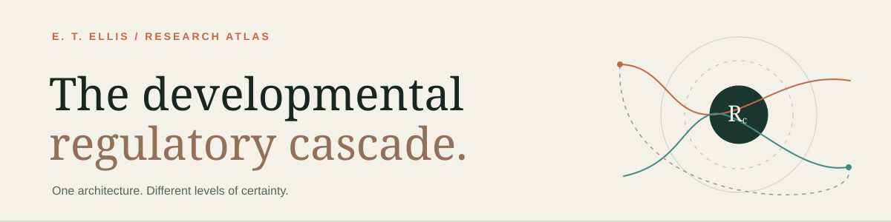

[](https://etellis.github.io/DRC/)

<p align="center"><a href="https://etellis.github.io/DRC/">Explore the live atlas ↗</a> · <a href="papers/integrated-paper.pdf">Read the paper</a> · <a href="data/evidence.json">Inspect the claims</a> · <a href="docs/PROVENANCE.md">Source lineage</a></p>

# The Developmental Regulatory Cascade

**E. T. Ellis · Integrated research program v1.1 · 25 September 2026**

DRC is a publication-format hypothesis manuscript and an interactive research atlas. It connects the RCCX–Hunter–Dąbrowski Cascade, *The Polymathic Singularity*, and the author's Perinatal Regulatory Initialization / α₂δ–CaV2 extension. The front-facing page is the [repository-root index.html](index.html), published from the root of main at [etellis.github.io/DRC](https://etellis.github.io/DRC/).

The theory retains recursion, environmental coupling, and heterogeneous trajectories. Its critical perinatal → α₂δ–CaV2 bridge remains **proposed**. An established result about one molecule, preparation, or task does not establish the full developmental chain.

## Explore the atlas

| Destination | What it provides |
| --- | --- |
| [Master field](https://etellis.github.io/DRC/#atlas) | Selectable layers and evidence-graded arrows, with source, boundary, rival, and falsifier |
| [Birth pathways](https://etellis.github.io/DRC/#mechanisms) | Endocrine and microbial routes kept distinct |
| [Social and channel mechanisms](https://etellis.github.io/DRC/#social) | Mouse social-reward pathway, human intervention limits, and α₂δ/CaV2 developmental handoff |
| [Across time](https://etellis.github.io/DRC/#recursion) | Later-life physiology → attention → action → environment feedback |
| [Regulatory closure](https://etellis.github.io/DRC/#closure) | Illustrative RCB control with measurement requirements |
| [Competing DAGs](https://etellis.github.io/DRC/#alternatives) | Candidate mediator, confounding-only, and hinge-bypass explanations |
| [Predictions and studies](https://etellis.github.io/DRC/#predictions) | Nine falsifiable predictions and three core studies plus a contingent intervention |
| [Claim ledger](https://etellis.github.io/DRC/#ledger) | Twenty-seven inspectable claims with status, design code, scope, uncertainty, rival, and sources |
| [Full paper and bibliography](https://etellis.github.io/DRC/#manuscript) | Readable manuscript, PDF, source collection, and 38 searchable references |

The layout uses a light editorial reading surface and darker causal diagrams. It works as a static GitHub Pages site and directly as a local file. It has no analytics, forms, cookies, external fonts, or runtime network requests. External connections occur only when a reader follows a scholarly or GitHub link.

## Evidence contract

Claim **status** is separate from study **design**:

- **Established mechanism:** direct evidence in the stated experimental system and outcome.
- **Supported synthesis:** a bounded finding or convergent interpretation; the transfer limit remains visible.
- **Proposed mechanism:** a named causal bridge that requires a direct test.
- **Horizon hypothesis:** a broader developmental or civilizational forecast.

Design codes E0–E5 identify conceptual, observational, animal/cell, or human intervention evidence. They are not numerical confidence scores. A source behind an E0 claim supplies background or author provenance, not proof of the arrow. The site retains contrary findings, including adjusted null birth-mode associations, mixed stress-methylation results, and the possibility that AI improves individual work while narrowing collective diversity.

## Read and rebuild

The authored, source-linked paper is [papers/integrated-paper.md](papers/integrated-paper.md). The [14-page two-column LaTeX PDF](papers/integrated-paper.pdf) has a centered abstract, numbered sections, causal figures, a claim appendix, and bibliography. Its modular source is [papers/latex/main.tex](papers/latex/main.tex) with ten section files and a reference library. The three named source documents are preserved in [papers/](papers/), alongside the earlier local source variants and their hashes in [sources/](sources/). [The integration crosswalk](docs/INTEGRATION_CROSSWALK.md) records what came from each supplied implementation and how duplicates were resolved. [Provenance](docs/PROVENANCE.md) separates received files, generated work, and the published repository.

To view the static site locally:

```sh
python3 -m http.server 8765
```

Open `http://localhost:8765/`. To rebuild the site, diagrams, paper PDF, and bundled data:

```sh
python3 scripts/build.py
python3 scripts/build_latex.py   # requires the tectonic CLI
python3 scripts/validate.py
```

The standard site build uses Python’s standard library. Tectonic builds the journal-style LaTeX PDF with bundled Latin Modern fonts. An optional legacy single-column PDF renderer remains available with `python3 scripts/build.py --legacy-pdf` and the packages in `requirements-build.txt`; it is not the publication edition. Generated site assets and the PDF are committed; site visitors need no build tools. GitHub Pages serves main at `/ (root)`.

## Repository map

| Path | Role |
| --- | --- |
| `index.html`, `src/style.css`, `src/light.css`, `src/app.js` | Front-facing site and behavior |
| `data/evidence.json`, `data/mechanisms.json`, `data/predictions.json` | Claim ledger, causal field, and tests |
| `data/citations.json` | Shared scholarly and project bibliography |
| `papers/integrated-paper.md`, `papers/latex/`, `papers/integrated-paper.pdf` | Shared prose, modular LaTeX publication edition, rendered PDF |
| `papers/perinatal-extension-source.md` | Preserved author perinatal draft |
| `sources/received/` | Exact user-supplied preview and source archive with SHA-256 hashes |
| `sources/original/` | Earlier locally available author PDF and TeX originals with hashes |
| `archive/first-atlas/` | Preserved initial DRC implementation and its narrower manuscript |
| `scripts/build.py`, `scripts/build_latex.py`, `scripts/validate.py` | Site, academic PDF, and consistency builds |

This is a research program, not a diagnostic or treatment tool, completed intervention, peer-reviewed finding, or systematic review. Code and interface styling are MIT licensed; authored manuscripts and theory remain copyright E. T. Ellis, all rights reserved, as detailed in [LICENSE](LICENSE).
